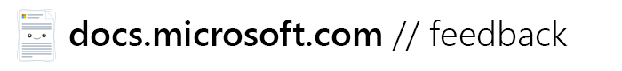
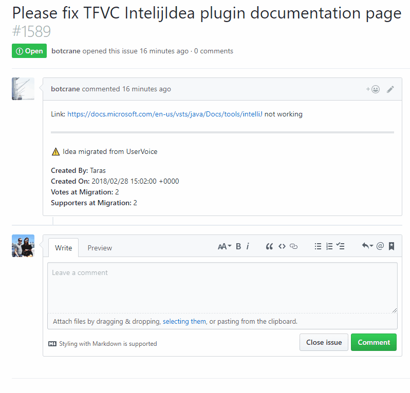

Welcome to the [docs.microsoft.com](https://docs.microsoft.com) feedback repository! This is the place to provide any comments, suggestions or ideas on **docs.microsoft.com site functionality**.

For content or product suggestions, please use the appropriate channels, usually available in the footer of the article you were reading.

## Submitting Ideas

Navigate to [**Issues**](https://github.com/MicrosoftDocs/feedback/issues) and open a new issue with all the relevant details. We will triage those as soon as possible.

## Code of Conduct

We follow the [Microsoft Open Source Code of Conduct](https://opensource.microsoft.com/codeofconduct/). We reserve the right to close, modify or remove ideas presented in this repository that are deemed to be in violation of the code of conduct.

## Questions

If you want to know something about [docs.microsoft.com](https://docs.microsoft.com), you can open an issue with `[Question]` at the start of the title to mark something as a question and not a suggestion to change/add functionality. Or you can [reach out to us on Twitter](https://twitter.com/docsmsft).

## FAQ

### I've already submitted my idea on UserVoice before. Is it gone?

If your idea was not marked as **Completed** or **Declined** on the docs.microsoft.com UserVoice site, it is migrated over to the GitHub issue tracker in this repo. You can comment on the suggestion and we will properly attribute it to you with a link to your GitHub profile.

### How quickly will you implement my suggestion?

Timeframes vary and we are unable to directly commit to any specific deadline after submission. That said, we will update the idea with the appropriate status once we have more details.

### Previously I could upvote ideas. How do I show support now?

You can take advantage of GitHub reactions. Simply open the issue, and add a reaction.

The added benefit to this is we also see how many people don't like a feature, compared to those that want it implemented - this allows us to design better functionality.
